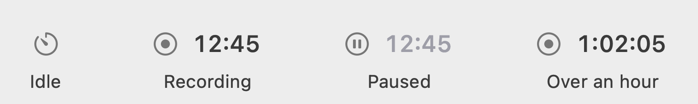
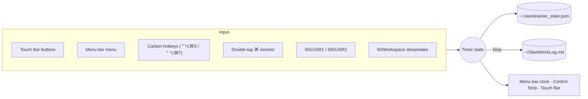

<div align="center">

# ⏱ SlackTracker

**A tiny, native-feeling work timer for your Mac's menu bar and Touch Bar.**<br>
Press Start. Press Stop. Every period lands in a clean Markdown log.

[](LICENSE)


<sub>Real capture from a 16" MacBook Pro Touch Bar: live period timer with Pause, Stop and Discard.</sub>

</div>

---

Most time trackers want an account, a project hierarchy and a browser tab. SlackTracker does one thing: it times **the period you're in right now** and writes it down when you're done. It lives where your eyes and fingers already are: the menu bar and the Touch Bar.

<sub>*Why the name?* It started life as an automatic Slack-usage tracker. It's now a general work timer, but the name stays: know exactly how much slack you've earned.</sub>

## ✨ Features

|   |   |
|:--|:--|
| 🎛 **Touch Bar Control Strip button** | The live timer sits permanently next to brightness and volume, whatever app is in front. Tap it for the full controls. |
| ⏯ **Start · Pause · Stop · Discard** | From the Touch Bar, the menu bar, or a global shortcut (⌃⌥⌘S). |
| 🕐 **Period-only clock** | Every Start begins at `0:00`. No daily totals in your face while you work. |
| 📝 **Markdown log** | Each Stop adds a row to that day's table in `~/SlackWorkLog.md`, with a running daily total. |
| 🏷 **Notes** | Tag a period with what you're working on, before or during it. |
| 😴 **Sleep-aware** | Closing the lid pauses the timer and waking resumes it. Sleep never counts as work. |
| 🔔 **Forgot to stop?** | A gentle reminder every 2 hours of running time. |
| 💾 **Crash-proof** | The running period is saved to disk and survives quits, crashes and reboots. |
| 🔒 **100% local** | No account, no network, no telemetry. Your data is a Markdown file you own. |

## 📸 A closer look

**Control Strip.** The timer stays visible in the Touch Bar's system area (red while recording, amber while paused), even while another app has the Touch Bar:


**Ready state.** Tap the Control Strip button or double-tap ⌘:


**Menu bar.** SF Symbols and monospaced digits, so the clock never jitters as it ticks:

<picture>
  <source media="(prefers-color-scheme: dark)" srcset="docs/images/menubar-dark.png">
  
</picture>

## 🚀 Install

```bash
git clone https://github.com/miqqidami/SlackTracker.git
cd SlackTracker
bash install.sh
```

That's it: ⏱ appears in your menu bar and SlackTracker starts automatically at login. No admin password, no account, no signing prompts.

<details>
<summary>What the installer does</summary>

- Copies `slacktracker.py` to `~/.slacktracker/` and creates a private virtualenv with `rumps` and `pyobjc-framework-Cocoa`.
- Registers a per-user `launchd` agent (`~/Library/LaunchAgents/com.slacktracker.plist`) that starts SlackTracker at login and restarts it if it ever crashes. Choosing **Quit** keeps it closed until your next login.
- Nothing is written outside your home folder.

</details>

<details>
<summary>Permissions</summary>

- **⌃⌥⌘S / ⌃⌥⌘T** use Carbon hotkeys and need no permission.
- **Double-tap ⌘** listens for modifier keys globally. If it doesn't respond, enable `~/.slacktracker/venv/bin/python` under *System Settings → Privacy & Security → Accessibility* (or just use the Control Strip button).
- **Notifications** appear under *Script Editor* in Notification settings, because they are posted with `osascript`.

</details>

**Uninstall:** `bash uninstall.sh` (keeps your log) or `bash uninstall.sh --purge`.

## ⌨️ Usage

| Action | Touch Bar | Menu bar | Keyboard |
|:--|:--|:--|:--|
| Start / Stop | Control Strip → **Start** / **Stop** | **Start Timer** / **Stop & Log** | `⌃⌥⌘S` |
| Pause / Resume | **Pause** / **Resume** | **Pause** / **Resume** | — |
| Throw away a period | 🗑 | **Discard Period** | — |
| Show Touch Bar controls | tap the Control Strip timer | **Show Touch Bar Controls** | `⌘` `⌘` or `⌃⌥⌘T` |
| Add a note | — | **Start with Note…** / **Edit Note…** | — |
| See today | — | **Today ▸** · **Copy Today's Summary** | — |

Scriptable too: `pkill -USR2 -f slacktracker.py` toggles the timer, which is handy for Shortcuts, Raycast or Alfred.

## 📒 The log

```markdown
## 2026-09-29 · Tuesday

| Start | End | Worked | Paused | Note |
|:------|:----|-------:|-------:|:-----|
| 09:00:00 | 10:17:33 | 1h 17m 33s | — | Code review |
| 11:00:00 | 12:10:00 | 1h 00m 00s | 10m 00s | API docs |
| 23:30:00 | 00:45:00 (+1d) | 1h 15m 00s | — | Release |

**Total:** 3h 32m 33s across 3 periods
```

It renders as a table on GitHub, in Obsidian and in any Markdown editor. Rows are never rewritten, so you can fix a note by hand and SlackTracker keeps your edit when it updates the total.

## ⚙️ Settings

All settings are in the menu under **Settings** and persist across launches:

| Setting | Default |
|:--|:--|
| Pause While Mac Sleeps | On |
| Show Seconds in Menu Bar | On |
| Auto-hide Touch Bar Controls (back to the Control Strip 3s after an action) | On |
| Remind Every 2 Hours | On |

## 🔧 How it works

SlackTracker is a single, dependency-light Python file that talks to AppKit directly through [PyObjC](https://pyobjc.readthedocs.io/):



- **Menu bar:** built on [`rumps`](https://github.com/jaredks/rumps). The status item is drawn with SF Symbols and a monospaced-digit attributed title.
- **Touch Bar:** an `NSTouchBar` presented system-wide with `presentSystemModalTouchBar`. The permanent Control Strip button uses the private `DFRFoundation` calls also used by apps like Pock and MTMR. Every private call is optional, so on Macs without a Touch Bar the app runs as a menu bar timer.
- **Global shortcuts:** registered through Carbon `RegisterEventHotKey` via `ctypes`, so no Accessibility permission is needed.
- **Thread safety:** hotkey, signal and sleep events only set flags. All UI and state changes happen on the main run loop.
- **Durability:** state is written atomically on every change, and the log is rewritten via a temp file and an atomic rename.

## 🧪 Development

```bash
python3 -m venv .venv && source .venv/bin/activate
pip install -r requirements.txt pytest pyflakes
pytest            # 26 tests: log formatting, pause/sleep maths, reminders, migrations
python slacktracker.py
```

See [CONTRIBUTING.md](CONTRIBUTING.md) for the code layout and guidelines, and [CHANGELOG.md](CHANGELOG.md) for release history.

## 🗺 Roadmap

- [ ] Weekly summary view and CSV export
- [ ] Quick-pick notes from recent entries on the Touch Bar
- [ ] Idle detection ("You've been away 20 min, keep or discard?")
- [ ] Signed, notarized `.app` download

Ideas and PRs are very welcome. [Open an issue](https://github.com/miqqidami/SlackTracker/issues/new/choose).

## 📄 License

[MIT](LICENSE) © miqqidami
